  # Topdanmark on-site Snowflake day - Cortex Demo (HOL)

## Overview

This repo is created to provide what you need to run the updated version of the demo which has been presented in Data for Breakfast event. In the event we have demostrated the solution and we haven't run the setup. But for this Hands on Lab, we will also spend time together to setup the demo environment where we will touch the ML functions.
## Prerequisites

You must have access to a Snowflake account where Snowflake Cortex ([check available regions](https://docs.snowflake.com/en/user-guide/snowflake-cortex/llm-functions#label-cortex-llm-availability)) and Snowflake Notebooks are enabled. We will use AWS Frankfurt region for this HOL, since the LLM functions we will be using are available in this region. Supposing that you have created a Trial account for AWS Frankfurt region, otherwise please create one via this [link](https://signup.snowflake.com/?utm_source=google&utm_medium=paidsearch&utm_campaign=em-dk-en-brand-trial-exact&utm_content=go-eta-evg-ss-free-trial&utm_term=c-g-snowflake%20trial-e&_bt=562156038952&_bk=snowflake%20trial&_bm=e&_bn=g&_bg=129534974844&gclsrc=aw.ds&gad_source=1&gclid=CjwKCAjwmYCzBhA6EiwAxFwfgCw9J9bW_ANxN7hSrOJeiF-sO7tFdSMyDKRrpNGWS6R9KLnfeJrvkBoC-tcQAvD_BwE).


## General Setup

- Create a new worksheet in Snowsight and copy SQL statements in [setup.sql](src/setup.sql) into the worksheet and run it to create various objects (including db, schema, warehouse, tables, etc.).
- Download data in .csv files from [here](https://github.com/sfc-gh-thanci/test/tree/main/data) and load data using Snowsight (see setup.sql for details).
**!!!DO NOT RUN last step (Train Forecast Model d4b_model) before loading data to the tables!!!**

- Using snowsigt load data to each of the tables by using the below options. (Snowsight leftpane menu -> Data -> Database -> DASH_D4B_DB -> DASH_D4B_SCHEMA -> TABLES -> Top right corner "Load" -> Browse -> Choose the related file)
<br />Header: Skip first line
<br />Field optionally enclosed by: Double quotes

<p align="center">
  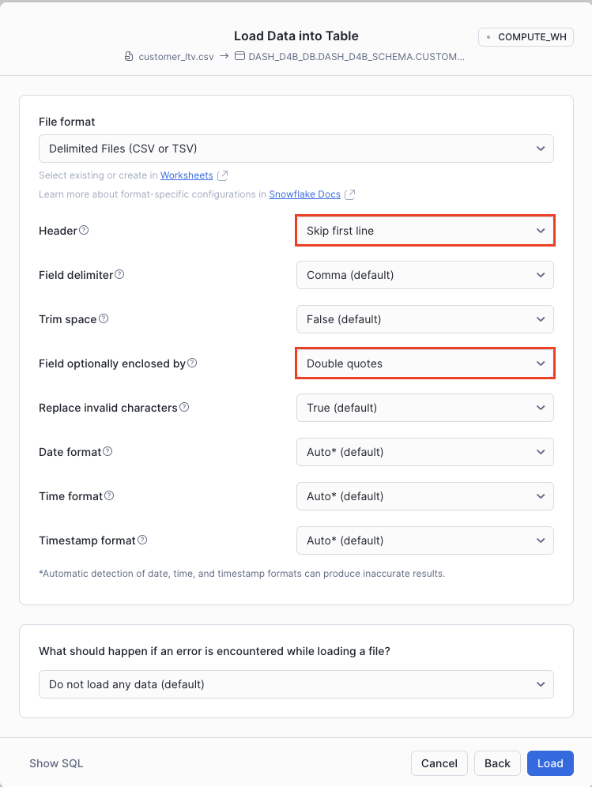
</p>


## DEMOS

## Demo 1 - Model Training
- **Option 1:** Create and train the model using Cortex ML Functions. Run the last command in the worksheet **Train Forecast Model d4b_model**, or just copy and run the below command.

          CREATE OR REPLACE SNOWFLAKE.ML.FORECAST
          d4b_model(INPUT_DATA => SYSTEM$REFERENCE('TABLE', 'DAILY_CALL_VOLUME'),
                    TIMESTAMP_COLNAME => 'date',
                    TARGET_COLNAME => 'total_calls');

- **Option 2:** Just for the practice purpose, please use the no-code UI "Snowflake AI&ML Studio" to create and train the model . Follow the screenshots below. **Note: Do not run the final script generated by the Studio, we will use the script provided above. 


Step 1:
<p align="center">
  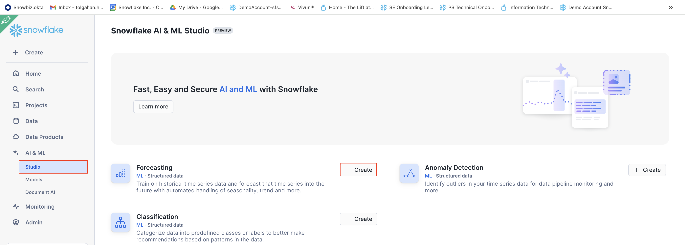
</p>
Step 2:
<p align="center">
  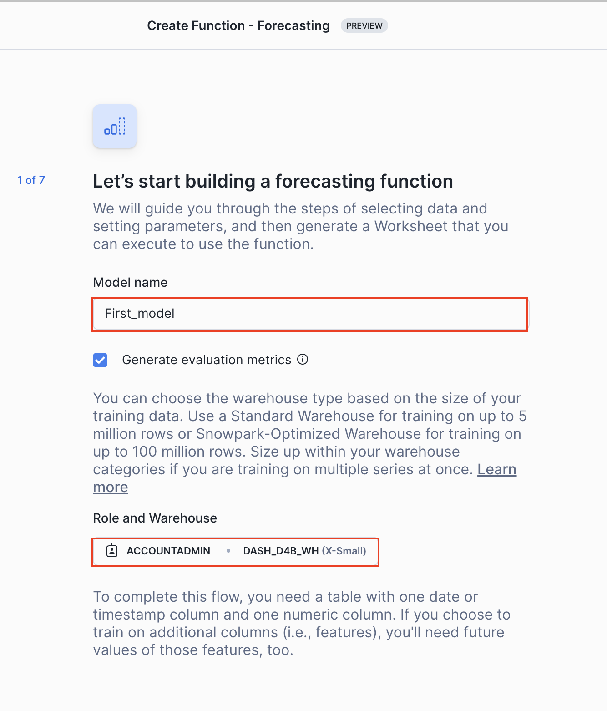
</p>
Step 3:
<p align="center">
  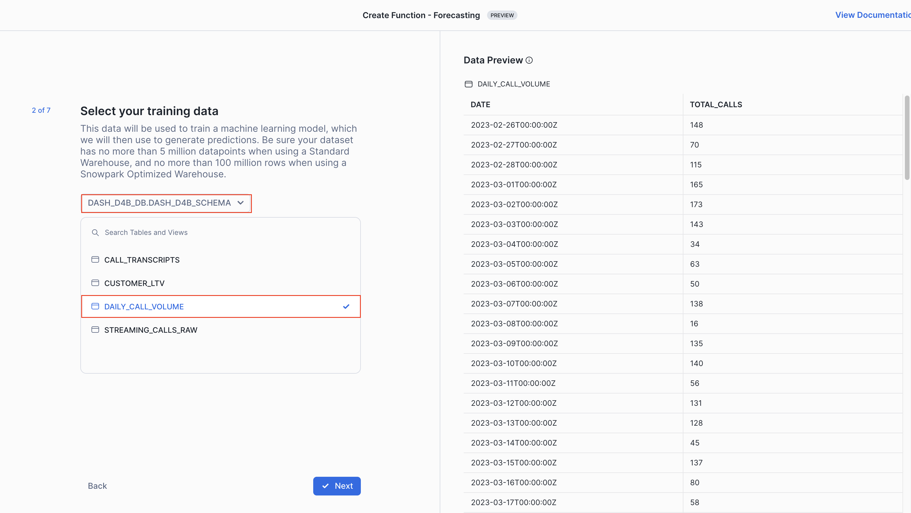
</p>
Step 4:
<p align="center">
  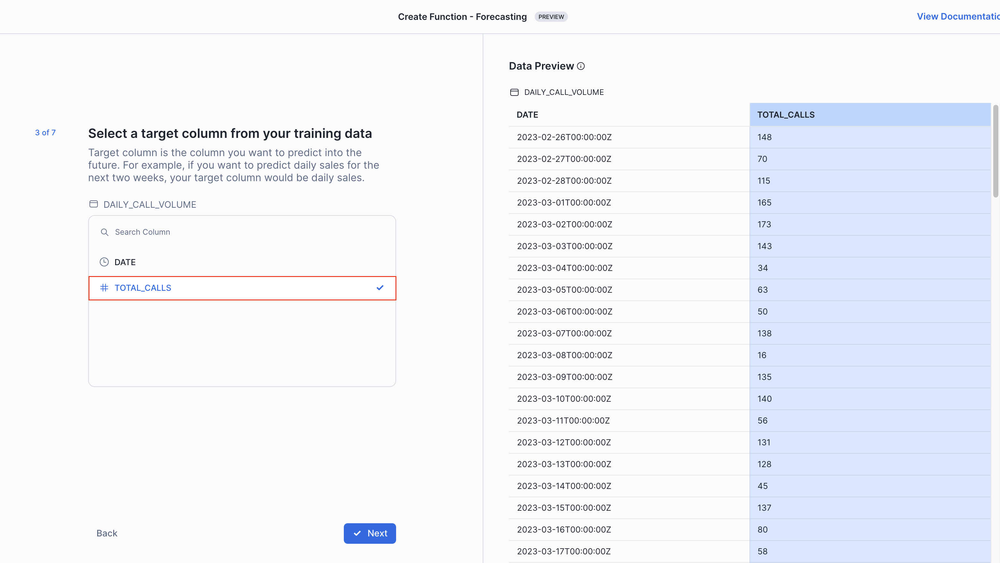
</p>
Step 5:
<p align="center">
  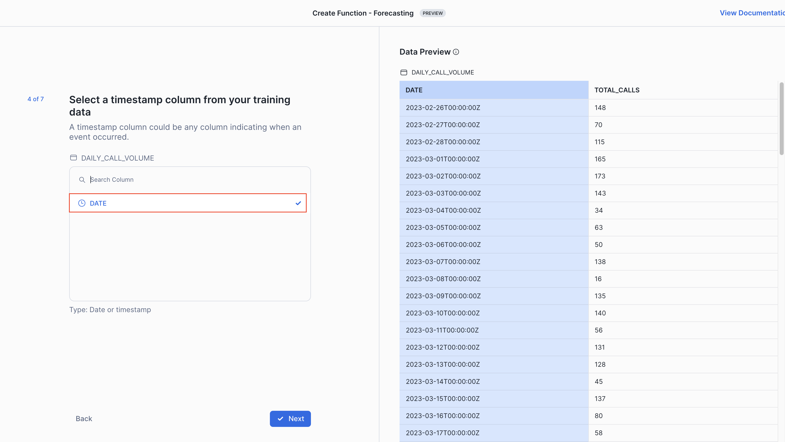
</p>
Step 6:
<p align="center">
  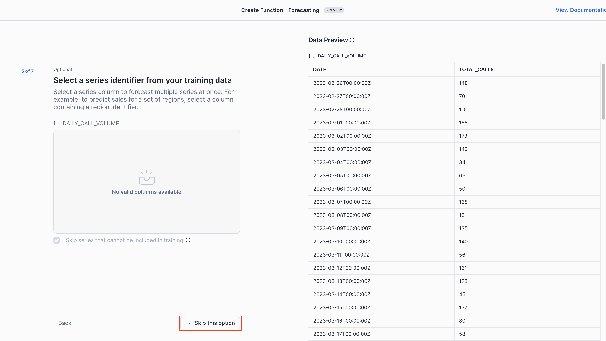
</p>
Step 7:
<p align="center">
  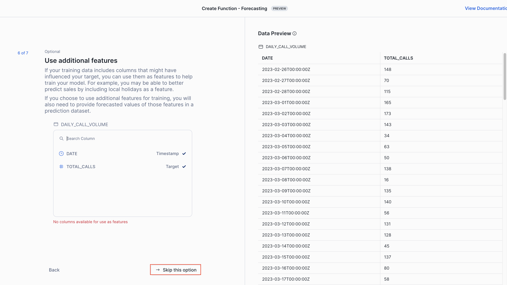
</p>
Step 8:
<p align="center">
  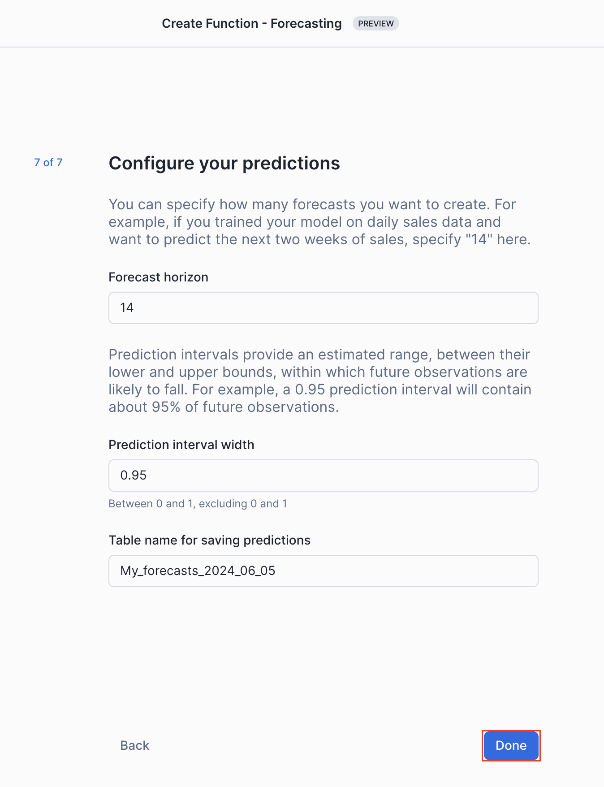
</p>

 **You don't need to final script generated by the Studio.**


## Demo 2 - Cortex LLM - Sentiment Analysis

- In this part of the demo we will run sentiment analysis of the call center transcipts using Cortex LLM function. We will use Snowflake Notebook to run the codes. 
**Download  [snowflake_cortex.ipynb](src/snowflake_cortex.ipynb) to your local and then upload it to Snowsight. 

***IMPORTANT***: Create your notebook in the following location DASH_D4B_DB > DASH_D4B_SCHEMA

<p align="center">
  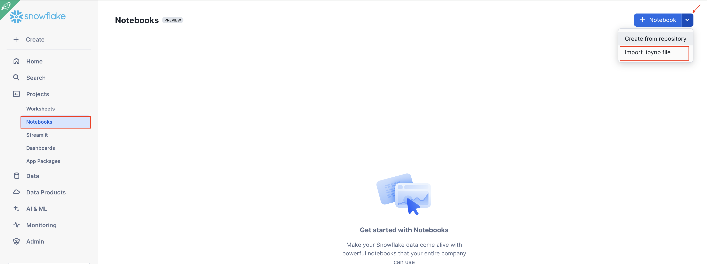
</p>


The demo section of the D4B is broken down into three parts.

Open [Snowflake Coxtex Notebook](src/snowflake_cortex.ipynb) and run the commands as show below. The purpose of this demo to be familiar with Snowflake Notebook and to see how easy to call/run Cortex LLM functions.

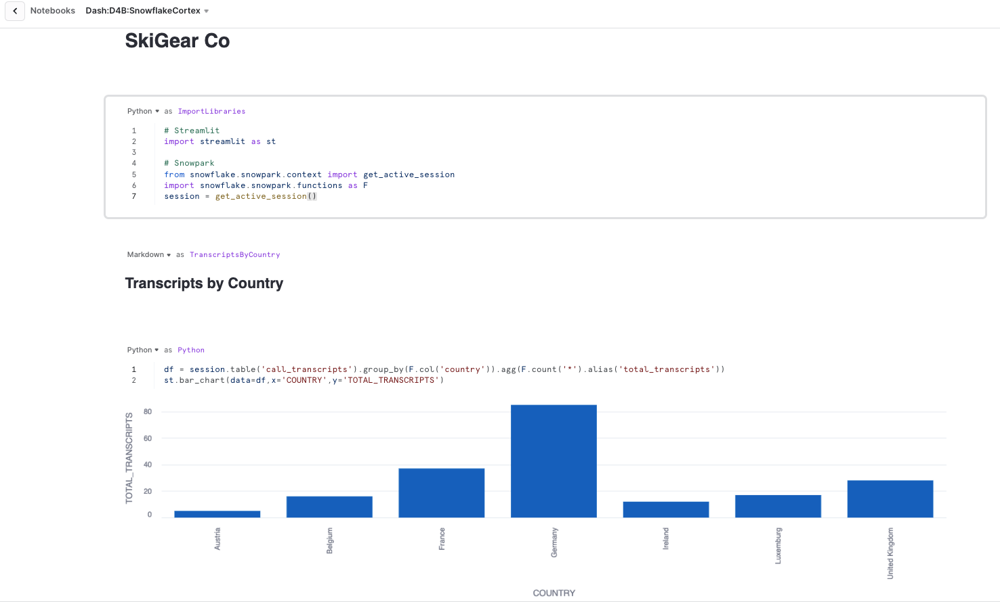

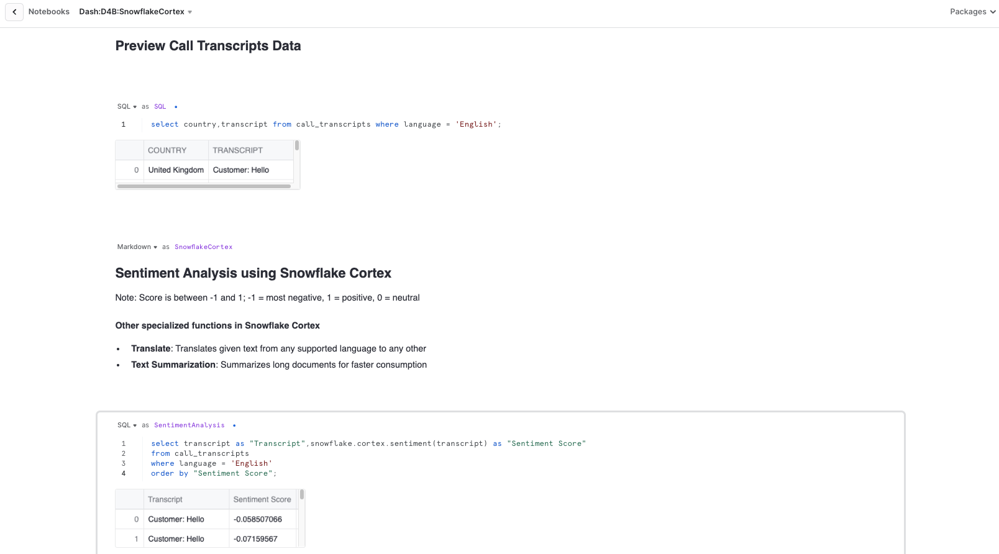

### Demo 3: Dynamic Tables

Download [dynamic_table_demo.sql](src/dynamic_table_demo.sql) and create a new SQL Worksheet using this code. Run the scripts to create Dynamic Tables.

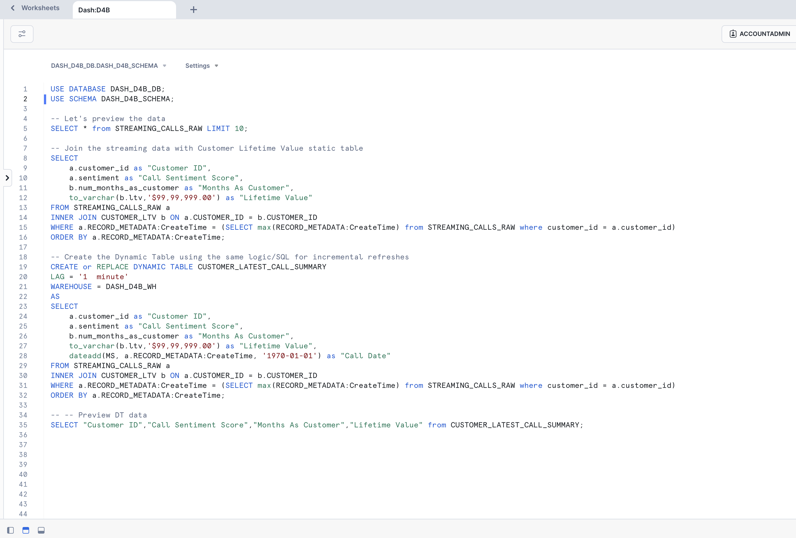

After running the code, check the DAG view of the dynamic table you have created under "Graph" tab and also check the refresh history details under the "Refresh History" tab.

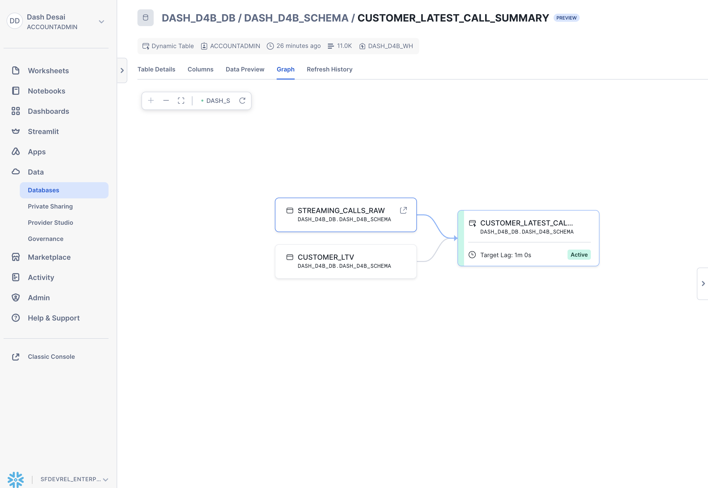


### Demo 4: Streamlit in Snowflake (SiS) Application

Create Streamlit application in your Snowflake account using the code provided in [sis_app.py](src/sis_app.py)


#### 1. Sentiment Analysis

Copy-paste this sample call transcript. This option will analysis the text you provided and provide the sentiment score using Cortex Sentiment Function.

```bash
Customer: Hello!
Agent: Hello! I hope you're having a great day. To best assist you, can you please share your first and last name and the company you're calling from?
Customer: Sure, I'm Michael Green from SnowSolutions.
Agent: Thanks, Michael! What can I help you with today?
Customer: We recently ordered several DryProof670 jackets for our store, but when we opened the package, we noticed that half of the jackets have broken zippers. We need to replace them quickly to ensure we have sufficient stock for our customers. Our order number is 60877.
Agent: I apologize for the inconvenience, Michael. Let me look into your order. It might take me a moment.
Customer: Thank you.
Agent: Michael, I've confirmed your order and the damage. Fortunately, we currently have enough stock to replace the damaged jackets. We'll send out the replacement jackets immediately, and they should arrive within 3-5 business days.
Customer: That's great to hear! How should we handle returning the damaged jackets?
Agent: We will provide you with a return shipping label so that you can send the damaged jackets back to us at no cost to you. Please place the jackets in the original packaging or a similar box.
Customer: Sounds good! Thanks for your help.
Agent: You're welcome, Michael! We apologize for the inconvenience, and thank you for your patience. Please don't hesitate to contact us if you have any further questions or concerns. Have a great day!
Customer: Thank you! You too. 
```

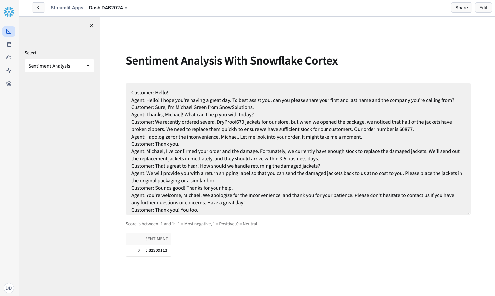

#### 2. Latest Call Summary

This option provide the summary of the latest call using the data in the Dynamic Table we have created in "Demo 3 - Dynamic Tables"

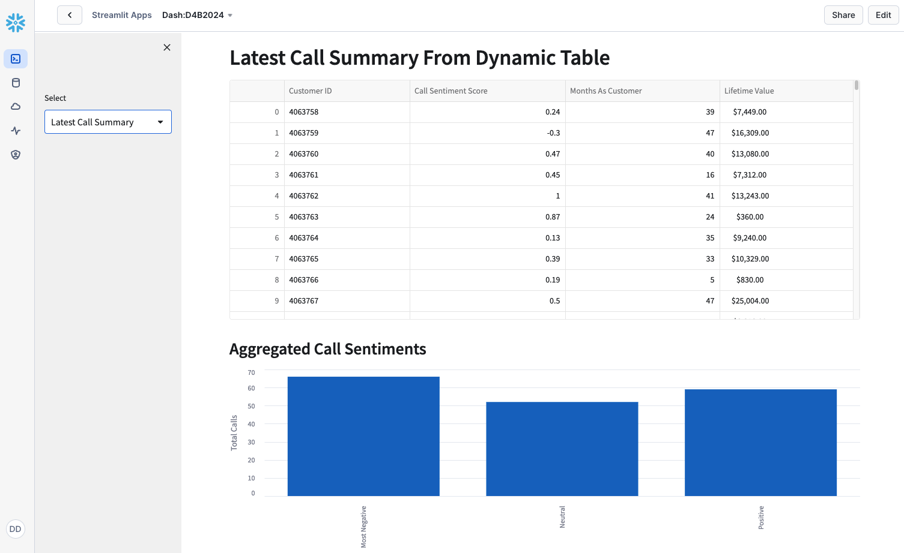

#### 3. Forecast Call Volume

This option will provide the forecasted call volumes using a line graph. Check the streamlit application code and see how easy the application call the model we have created in the frist step (line 26)

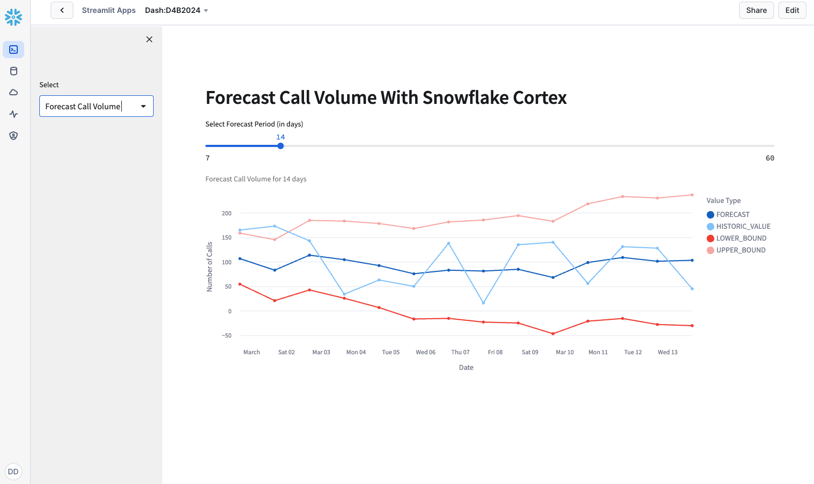

## Cleanup

After your demo delete the dynamic table by executing `DROP DYNAMIC TABLE CUSTOMER_LATEST_CALL_SUMMARY;`

